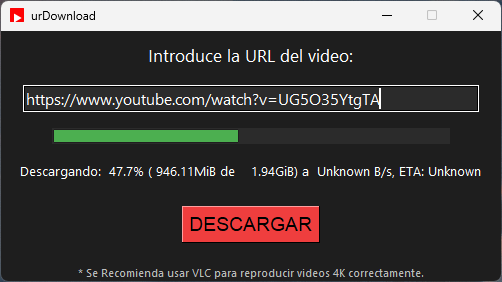

<h1 align="center">📥 urDownload</h1>


**urDownload** es una aplicación de escritorio desarrollada en Python con `tkinter` y `yt-dlp` que permite descargar videos de YouTube con una interfaz amigable, moderna y sin complicaciones.

> 🚀 Rápido. 🎯 Preciso. 🧼 Limpio.

---

## 🖥️ Características

- Descarga videos en la mejor calidad disponible (hasta 4K+ si el video lo permite).
- Interfaz gráfica minimalista y elegante con tema oscuro.
- Indicador visual de progreso de descarga.
- Avisos inteligentes sobre compatibilidad de códecs (¡adiós confusiones con el reproductor de Windows!).
- Completamente libre y de código abierto.

---

## 📸 Capturas


---

## ⚙️ Requisitos

- Python 3.8 o superior
- Windows (actualmente soportado y probado en Windows 10 y 11)
- Ejecutables: `yt-dlp.exe` y `ffmpeg.exe` deben estar en la misma carpeta que el ejecutable o empaquetados con PyInstaller.

---

## 📦 Instalación y uso

1. Clona el repositorio:

   ```bash
   git clone https://github.com/dunp3r/urDownload.git
   cd urDownload
   python3 main.py


## 🛡️ Licencia

Este software está licenciado bajo la Licencia Pública General GNU, versión 3 (GPLv3).  
Consulta el archivo `LICENSE` para más detalles.

## 📦 Componentes de terceros

Este programa incluye los siguientes ejecutables redistribuidos:

- **ffmpeg** – Procesamiento multimedia – [https://ffmpeg.org](https://ffmpeg.org) – Licencia: GPLv3
- **yt-dlp** – Descarga de contenido multimedia – [https://github.com/yt-dlp/yt-dlp](https://github.com/yt-dlp/yt-dlp) – Licencia: MIT

Consulta el archivo `THIRD_PARTY.txt` para detalles completos de las licencias de estos componentes.

Consulta [ATTRIBUTION.md](ATTRIBUTION.md) para créditos de terceros.

---
<p align="center">Made with 💚 by dunp3r - 2025</p>


